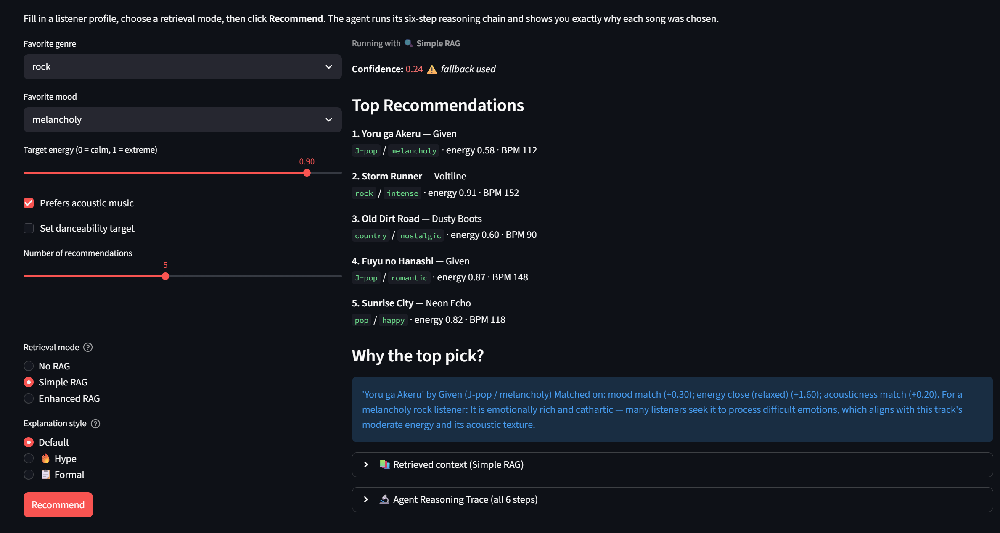
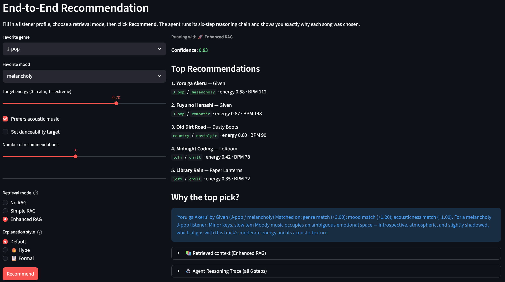

The original project was the music recommendation system from Module 3. The original goals and capabilities were to recommend music to people using simple RAG and hard-coded rules.

# RecOrded

A music recommendation engine that scores songs against a user's taste profile and uses a built-in **reliability layer** to measure its own confidence and adapt when results are weak. Optionally accepts natural language input via a HuggingFace zero-shot classification model that converts free text into a structured user profile. The goal is to get the music RECords in ORDer from most to least recommended based on user preferences. This project allows users to explore and discover new music without being overwhelmed by the myriad variety of songs out there.

---

## Architecture Overview

The diagram shows the end-to-end flow of the music recommendation system:

1. User input is classified — if it's free text, it goes through the NLPProfileParser to extract a structured profile; structured input skips that step.
2. The profile is handed to the RecommenderAgent, which runs several internal steps: analyzing the profile, planning a strategy, scoring candidates, running RAG retrieval against a local document store (data/docs), checking confidence, assembling an explanation, and applying fallback logic if needed.
3. The agent's core scoring is a distinct sub-component that feeds back into the quality check.
4. The final output is a RecommendationResult surfaced to the user or CLI.
5. Unit tests independently validate the core scoring, quality check, and fallback logic.
---

## Setup Instructions

### 1. Clone and enter the repo
```bash
git clone <repo-url>
cd applied-ai-system-project
```

### 2. Install dependencies
```bash
pip install -r requirements.txt
```

> `transformers` and `torch` are required for the NLP input mode. On first run, `facebook/bart-large-mnli` (~1.6 GB) will be downloaded and cached automatically by HuggingFace.

### 3. Run with preset profiles (no model download required)
```bash
python src/main.py
```

### 4. Run in natural language input mode
```bash
python src/main.py --nlp
```
Type a description at the prompt, e.g. `upbeat pop for a workout`, and the system will classify it into a profile and recommend songs.

### 5. Run the test suite
```bash
pytest tests/test_recommender.py -v
```
---

## Design Decisions

### Why rule-based scoring with an integrated reliability layer, rather than a pure ML model?

The catalog has only 20 songs. Training or fine-tuning a collaborative filtering or neural model on 20 data points would overfit immediately as the dataset is too small. Rule-based weighted scoring is transparent, debuggable, and appropriate for the data size. The reliability layer is the more interesting engineering choice: rather than silently returning whatever scores come out, the system measures its own output distribution and changes behavior when confidence is low.

**Trade-off:** The confidence threshold (0.35) and relaxed tolerances (+/-0.40) are arbitrarily chosen. A larger catalog would allow for a more robust set of data where hyperparameters can be tuned with more data-driven methods.

### Why `facebook/bart-large-mnli` for the NLP parser?

Zero-shot classification with an NLI model requires no labeled training data for our specific task — the model was pre-trained to understand entailment across many domains. We supply our label sets (genres, moods, energy levels) and it generalizes without any task-specific fine-tuning.

**Trade-off:** The model is ~1.6 GB and adds latency on first use. A production system would swap in a smaller distilled model (e.g., `typeform/distilbert-base-uncased-mnli`) or cache parsed profiles to avoid repeated inference.

### Why expose `RecommendationResult` instead of a plain list?

Returning a plain `List[Song]` hides quality information from the caller. By returning a structured result with `confidence`, `used_fallback`, and `quality_note`, every consumer — CLI, UI, test — can make an informed decision about how much to trust the output. This makes the reliability system observable rather than invisible.

### Testing Summary
Few shot functionality did not work very well and therefore had to be scrapped because the models used gave very generic answers. Perhaps I needed to fine-tune a model in order to get better results. However, fine-tuning a model can be time-consuming.


A low confidence rating was given to the prediction. With that, I realized that I did not consider how a song can fall under multiple genres. To the end, I decided to try to fix the RAG function by using AI to create a document with more detailed information about the songs.


After doing so, the confidence level has increased.

### Reflection
This taught me that AI needs a lot of structure and guidance to work effectively and efficiently. Even with AI, there still needs to be a lot of thought put into each design decision in order for the app to better achieve its purpose. Although there are less biases now that the dataset is slightly larger, there will still be biases. The system is still limited by the small dataset. The AI does have the potential to be misused now that a language model is involved in some of the functionalities. This could happen if someone launches a prompt injection attack. In order to prevent those from happening, I should put guardrails in place to guide and restrict the model's behavior.

### Testing and Reliability

- I used unit tests with 15 pytest cases covering confidence math, fallback behavior, adversarial profiles, and output structure.
- The `quality_note` field surfaces confidence information directly to the user (me) so a human (also me) can decide whether to trust the results. This helps me to refine the project even further during the process of development.
- The AI struggled a lot when context was missing as it put in very generic answers, some of which did not relate at all to the dataset. Furthermore, when weights were low and tolerance ranges for energy and danceability were high, the models recommended songs with very low confidence (~0.14).


### What this project says about me as an AI engineer:
It shows that I am able to think through a problem systematically and be able to iterate and improve upon an existing solution while making use of AI to speed up my workflow.

### Loom Video Links
Whole System:
https://www.loom.com/share/866aa8e790c84e018fc9b9302c032d2e
Testing Suite (because original video cut off at 5 minutes):
https://www.loom.com/share/e623ce6a80ee49f581820ac7a8c091b6
